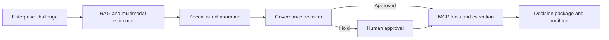

# Enterprise Agentic AI Transformation Starter Kit

A reusable, governed reference implementation that combines:

- Retrieval-Augmented Generation (RAG)
- Agentic AI and controlled tool execution
- Multimodal AI for image/document evidence
- Multi-agent specialist collaboration
- LangGraph stateful orchestration
- CrewAI collaborative orchestration
- Model Context Protocol (MCP) server/client integration
- FastAPI, Gradio, CLI, audit logging, governance gates, and human approval

The sample domain is enterprise AI transformation. Configuration profiles also demonstrate process intelligence and public finance management. The same foundation can be extended to service management, corporate operations, risk, quality, procurement, HR, legal, and enterprise architecture.

## What the system does

The workflow can retrieve evidence, analyze images, reason through specialist perspectives, use tools, collaborate, prepare an executive recommendation, assess value and risk, pause for approval, and execute authorized actions with audit receipts.



## Project map

| Component | File | Purpose |
|---|---|---|
| RAG | `rag.py` | Approved-source retrieval with Chroma and offline fallback |
| Multimodal | `multimodal.py` | Image evidence analysis through a model adapter |
| Agentic tools | `tools.py` | Search, assessment, value, and action-plan tools |
| Specialist agents | `agents.py` | Strategy, process/PFM, architecture, risk, value, synthesis |
| LangGraph | `workflow_langgraph.py` | Stateful governed lifecycle and execution routing |
| CrewAI | `workflow_crewai.py` | Alternative collaborative crew implementation |
| Governance | `governance.py` | Risk scoring, controls, approval, execution boundary |
| MCP | `mcp_server.py`, `mcp_client.py` | Tool/resource exposure and discovery |
| Interfaces | `api.py`, `ui.py`, `cli.py` | API, Gradio studio, and command line |
| Audit | `audit.py` | JSONL workflow and execution events |

## Quick start

```bash
python -m venv .venv
source .venv/bin/activate          # Windows: .venv\Scripts\activate
pip install -e ".[dev]"
cp .env.example .env
```

The default `MODEL_PROVIDER=deterministic` runs without API credentials and is useful for validating architecture and workflow mechanics. For real LLM reasoning, configure one provider:

```env
MODEL_PROVIDER=openai
MODEL_NAME=gpt-4.1-mini
OPENAI_API_KEY=...
```

or:

```env
MODEL_PROVIDER=watsonx
MODEL_NAME=ibm/granite-4-h-small
WATSONX_APIKEY=...
WATSONX_PROJECT_ID=...
```

Do not commit `.env` or credentials.

## Run the LangGraph workflow

```bash
enterprise-ai \
  "Prioritize and govern AI use cases across corporate operations" \
  --title "Enterprise AI Portfolio" \
  --objective "Establish a measurable, controlled transformation roadmap"
```

## Run the CrewAI alternative

```bash
enterprise-ai \
  "Assess an intelligent process-improvement opportunity" \
  --profile process_intelligence \
  --orchestrator crewai
```

## Run the interfaces

```bash
uvicorn enterprise_ai.api:app --reload
python -m enterprise_ai.ui
```

- API health: `http://127.0.0.1:8000/health`
- API docs: `http://127.0.0.1:8000/docs`
- Gradio: terminal-provided URL, normally `http://127.0.0.1:7860`

## Run MCP

```bash
python -m enterprise_ai.mcp_server
python -m enterprise_ai.mcp_client
```

The MCP server exposes:

- `enterprise://operating-principles` resource
- `search_enterprise_knowledge`
- `assess_enterprise_use_case`
- `estimate_enterprise_value`
- `create_enterprise_action_plan`

## Add enterprise knowledge

Place approved `.md`, `.txt`, `.json`, or `.csv` files under `data/knowledge/`. The RAG layer chunks them, retains source identifiers, and returns citations. In production, replace this local source with permission-aware enterprise repositories.

## Governance and execution model

The platform distinguishes analysis from execution:

1. Retrieval and specialist agents prepare advisory findings.
2. The governance engine scores risk and assigns controls.
3. High-risk or consequential work is held for human approval.
4. Only authorized requests can invoke execution tools.
5. Every tool call and workflow decision is written to an audit log.

This is a reference implementation, not a substitute for organizational policies, legal assessment, cybersecurity review, or accountable human decisions.

## Verification

```bash
python -m compileall src
pytest
```

See [architecture.md](docs/architecture.md) and [enterprise_use_cases.md](docs/enterprise_use_cases.md) for the operating model and adaptation guidance.

