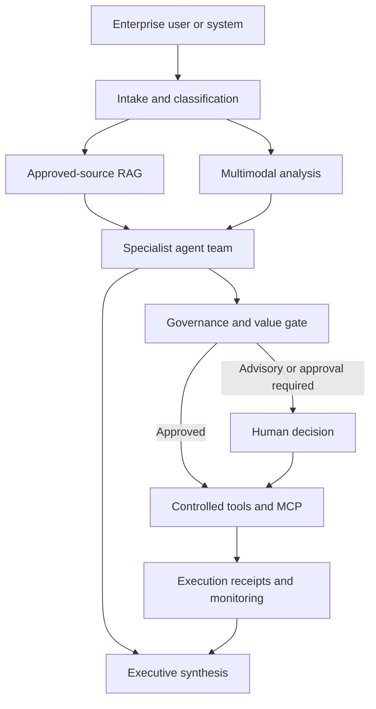

# Enterprise Reference Architecture

## Operating cycle

| Phase | Core output | Control point |
|---|---|---|
| Discover | Challenge, owner, stakeholders, baseline | Scope approval |
| Assess | Evidence, feasibility, value, risk | Prioritization gate |
| Design | Architecture, data, process, controls | Design authority |
| Approve | Funding, accountability, residual risk | Human authorization |
| Pilot | Tested workflow and acceptance evidence | Go/no-go gate |
| Scale | Production service and operating model | Release approval |
| Monitor | KPIs, drift, incidents, benefits | Periodic review |

## Enterprise controls

- Approved-source retrieval with citations
- Least-privilege MCP tools and explicit allowlists
- Human approval for consequential or high-risk actions
- End-to-end audit events and execution receipts
- Model/provider abstraction to reduce lock-in
- Separation of advisory analysis from write/execution authority
- Measurable baseline, target, owner, and value-realization plan

