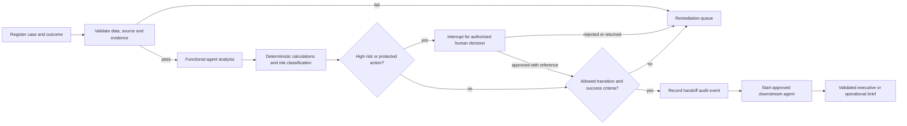

# Controlled PFM Workflow

## Handoff contract

Each handoff records the case/workflow, current and next agent, payload, success criteria, evidence, assumptions, input validation state, calculated output, risk, approval interruption/reference, escalation, failure route and timestamp. The next agent cannot start when the state is `BLOCKED`.

High-risk approval references demonstrate workflow authorization only; they do not by themselves prove a valid legal or financial delegation. Production integration must verify the authority system of record.
