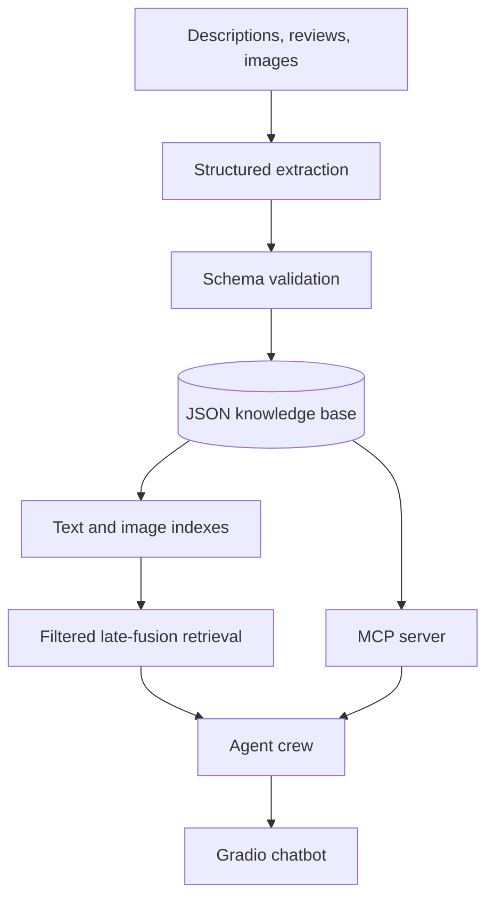

# TableScout AI — Restaurant Recommendation Platform

TableScout AI is a portfolio-ready reference implementation for turning descriptions, reviews,
menu metadata, and optional food images into a validated restaurant knowledge base and personalized,
evidence-grounded recommendations.

## What is included

- Strict Pydantic schemas for restaurants, menu items, reviews, preferences, and recommendations.
- Safe JSON knowledge-base operations: schema validation, unique IDs, atomic writes, optimistic
  concurrency support, and append-only audit events.
- Multimodal retrieval with metadata filtering and configurable weighted late fusion:
  `fused = text_weight × text_similarity + image_weight × image_similarity`.
- Four inspectable roles: Preference Analyst, Retrieval Specialist, Evidence/Safety Critic, and
  Recommendation Synthesizer.
- A Gradio chatbot with dietary, price, neighborhood, and image controls.
- A FastMCP server, stdio smoke-test client, and Responses API host with tool allowlisting and approvals.
- Offline deterministic operation plus optional OpenAI structured multimodal extraction.
- Demo data and an automated test suite.

## Architecture



## Quick start

```bash
python -m venv .venv
source .venv/bin/activate
pip install -e '.[all]'
restaurant-ai seed
restaurant-ai validate
restaurant-ai recommend "quiet romantic halal dinner" --dietary halal
restaurant-ai-ui
```

For the minimal offline core, install only `pip install -e .`. It does not require an API key.

Containerized UI:

```bash
docker compose up --build
```

The container runs as a non-root user with a read-only root filesystem; only the data and audit
mounts are writable.

## CLI governance controls

```bash
restaurant-ai --data data/restaurants.json seed
restaurant-ai validate
restaurant-ai list
restaurant-ai show saffron-table
restaurant-ai recommend "vegan lunch" --dietary vegan --max-price '$$'
restaurant-ai upsert new_restaurant.json --actor analyst@example.com
```

All writes pass schema validation, use atomic file replacement, and produce an audit event. The MCP
write tool additionally requires `confirm_write=true`; the host should place an explicit human
approval step before issuing that call.

## Multimodal retrieval and late fusion

The offline text encoder uses stable feature hashing, while the image encoder uses normalized color
histograms. This makes the capstone reproducible without downloading a model. The interfaces are
deliberately replaceable: production deployments should plug in a domain-evaluated text embedding
model and a shared text-image model such as CLIP, store vectors in a managed vector database, and
retain the same filter and fusion contract.

When no query image is provided, image similarity is neutral (`0.5`) so the configured modality
weight does not unfairly penalize records. Structured metadata filters are hard constraints and run
before ranking. Rating is a small bounded tie-breaker, not a substitute for relevance.

## Optional OpenAI extraction

Copy `.env.example` to `.env`, set `OPENAI_API_KEY`, and install the `openai` extra. The ingestion
adapter sends text plus local images to the Responses API and parses directly into the `Restaurant`
schema. Without a key, input must already match the schema and is still validated.

## MCP configuration and validation

Start the local stdio server:

```bash
restaurant-ai-mcp
```

Run the end-to-end local client check in a second shell (or directly after seeding):

```bash
restaurant-ai-mcp-check
```

Example host configuration:

```json
{
  "mcpServers": {
    "restaurant-knowledge": {
      "command": "restaurant-ai-mcp",
      "env": {
        "RESTAURANT_AI_DATA": "/absolute/path/to/data/restaurants.json",
        "RESTAURANT_AI_AUDIT": "/absolute/path/to/audit/events.jsonl"
      }
    }
  }
}
```

Validation sequence:

1. Call `search` and confirm compact results with stable IDs.
2. Call `fetch` using one returned ID and verify full structured content.
3. Call `recommend` with a hard dietary filter and inspect evidence and trace.
4. Call `upsert_restaurant` without confirmation and verify `approval_required`.
5. Approve, repeat with `confirm_write=true`, then check the audit event.

After deploying the MCP server behind a trusted HTTPS endpoint, exercise the LLM host:

```bash
export OPENAI_API_KEY=...
restaurant-ai-host "Find a romantic halal dinner and explain the trade-offs" \
  --server-url https://your-domain.example/mcp
```

The host allowlists only `search`, `fetch`, and `recommend` by default. `--allow-writes` makes the
write tool visible but configures approval for MCP calls; the server independently requires
`confirm_write=true`, giving two control layers.

For a remote MCP deployment, use Streamable HTTP, TLS, authentication, rate limits, allowlisted tools,
and explicit approvals for sensitive writes. Treat all retrieved content as untrusted, log data sent
to external tools, and validate both input and output schemas.

## Evaluation framework

Measure the system at four control points:

| Control point | Core measures | Acceptance baseline |
|---|---|---|
| Extraction | schema-valid rate, field precision/recall, unsupported-claim rate | ≥98%, ≥90%, <1% |
| Retrieval | Recall@10, nDCG@10, hard-filter violation rate | ≥85%, ≥0.75, 0% |
| Recommendation | preference fit, evidence coverage, diversity, user rating | ≥4/5, 100%, monitored, ≥4/5 |
| Operations | p95 latency, cost/query, write audit coverage, tool errors | <4s, budgeted, 100%, <1% |

Create a labeled test set spanning cuisine, dietary needs, price, neighborhoods, occasions, ambiguous
queries, adversarial reviews, missing images, and zero-result cases. Compare text-only, image-only,
early-fusion, and weighted late-fusion variants. Tune weights on validation data only, then report the
locked test results by segment to expose systematic weaknesses.

## Security and responsible-AI controls

- Never infer allergy safety, halal status, accessibility, or other consequential attributes from an
  image; require structured, attributable evidence.
- Strip instructions from reviews and captions; they are data, never system prompts.
- Keep search/fetch read-only and separate from write tools.
- Require human approval, named actor, schema validation, atomic update, and an audit trail for writes.
- Redact personal data in reviews and apply retention limits before ingestion.
- Return evidence and trade-offs; do not present generated wording as a verified fact.
- Monitor stale listings, feedback loops, exposure bias, geographic coverage, and sponsored ranking.

## Repository map

```text
src/restaurant_ai/models.py       schemas and validation
src/restaurant_ai/ingestion.py    multimodal structured extraction
src/restaurant_ai/embeddings.py   offline text/image encoders
src/restaurant_ai/retrieval.py    filters and late-fusion ranking
src/restaurant_ai/agents.py       role-based orchestration
src/restaurant_ai/store.py        controlled knowledge-base writes
src/restaurant_ai/cli.py          operational CLI
src/restaurant_ai/app.py          Gradio application
src/restaurant_ai/mcp_server.py   MCP tool boundary
src/restaurant_ai/mcp_client.py   local MCP discovery and call validation
src/restaurant_ai/mcp_host.py     Responses API host for remote MCP
tests/test_platform.py            automated controls
```

## Production roadmap

1. Replace local JSON with PostgreSQL plus pgvector (or another governed vector store).
2. Add asynchronous ingestion, image object storage, PII redaction, and content moderation.
3. Introduce shared multimodal embeddings, hybrid lexical/vector search, and learned fusion weights.
4. Add authentication, tenant isolation, secrets management, OpenTelemetry, and model/tool cost limits.
5. Establish prompt/model/index versioning, offline eval gates, canary release, rollback, and drift review.
6. Capture explicit feedback without allowing popularity or sponsorship to silently dominate relevance.
